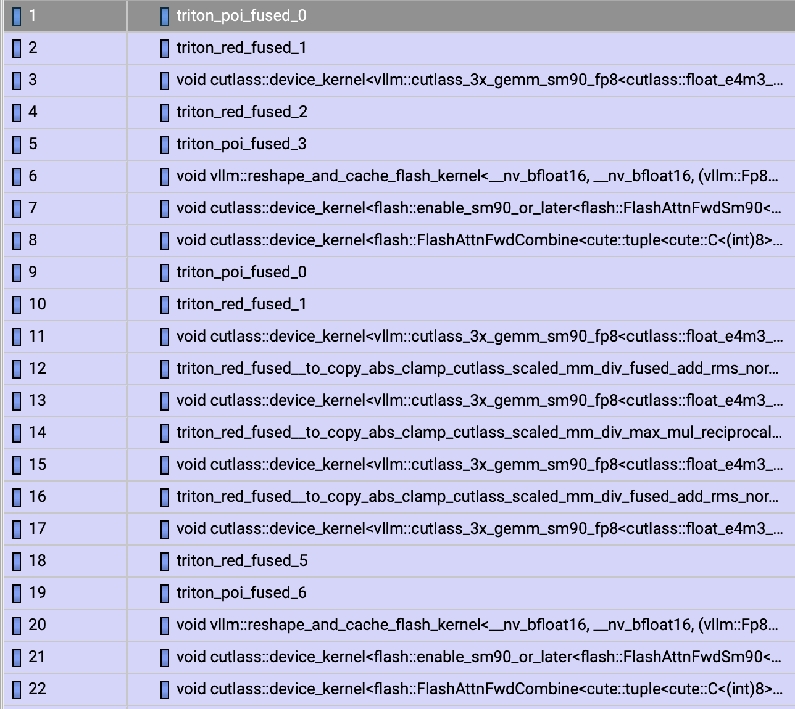
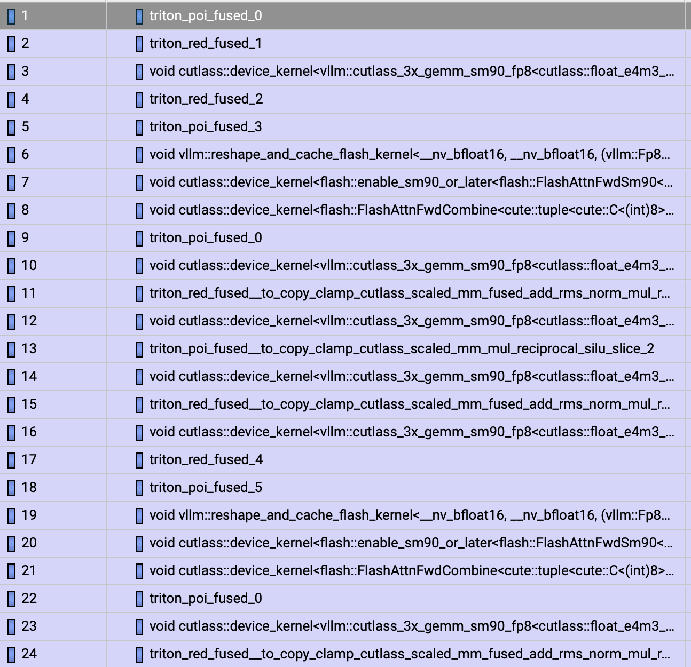
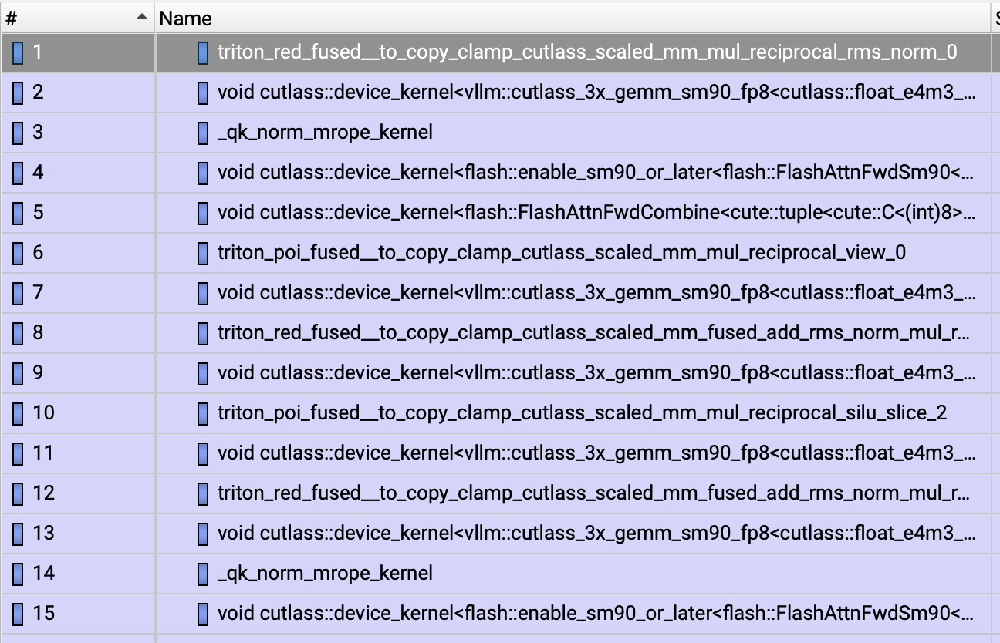

# Nsight Systems guide: FP8 optimizations in Qwen3-ASR

This document is the durable reference for the Nsight Systems investigation of
Qwen3-ASR decoding with vLLM dynamic FP8, calibrated static-activation FP8, and
the static-FP8 path with fused Q/K RMSNorm, MRoPE, and KV-cache update. It
records the capture workflow, the meaning of the two trace modes, correct timing
methodology, how the dominant CUDA graph was identified, the measured
differences, and the row-by-row decoder pseudocode represented by each kernel
order.

Related documents:

- [Static FP8 activation calibration](fp8-calibration.md) explains how the
  calibration dataset is run and how the portable scale JSON is produced.
- [Out-of-tree vLLM static-FP8 extension](vllm-static-fp8-extension.md)
  explains how the JSON is registered with and injected into vLLM.
- [FlashAttention forward combine in Nsight Systems](flashattention-forward-combine.md)
  explains the split-KV path behind the `FlashAttnFwdSm90` and
  `FlashAttnFwdCombine` pair visible in each decoder layer.
- [Fused Q/K RMSNorm, MRoPE, and KV-cache update](qk-mrope-kv-cache-fusion.md)
  documents the implementation, dispatch constraints, correctness checks, and
  benchmark results for the fused kernel analyzed here.

## Executive summary

The central result is not that either optimization changes the model. All
three captures run the same 28-layer Qwen3 decoder, with the same:

- 112 CUTLASS FP8 GEMMs per dominant CUDA-graph replay;
- 28 FlashAttention forward kernels;
- 28 FlashAttention combine kernels;
- 28 logical KV-cache writes;
- 20 replays of the dominant decode graph in the captured request.

Static FP8 changes how the input activation scale for each FP8 linear is
obtained:

```text
Dynamic FP8:
    current activation
    -> abs
    -> row/token max reduction
    -> runtime scale
    -> FP8 cast
    -> CUTLASS FP8 GEMM

Static FP8:
    current activation
    -> load calibrated layer scalar
    -> FP8 cast
    -> CUTLASS FP8 GEMM
```

Using the current matched node-trace artifacts, the dominant decode graph
changes as follows:

| Metric per graph replay | Dynamic FP8 | Static FP8 | Fused static FP8 | Static vs dynamic | Fused vs static |
| --- | ---: | ---: | ---: | ---: | ---: |
| Executed kernel nodes | 393 | 366 | 309 | -27 (-6.9%) | -57 (-15.6%) |
| First-node to last-node envelope | 1.950 ms | 1.649 ms | 1.613 ms | -0.301 ms (-15.4%) | -0.036 ms (-2.2%) |
| Sum of kernel durations | 1.786 ms | 1.627 ms | 1.486 ms | -0.159 ms (-8.9%) | -0.141 ms (-8.6%) |
| Explicit `_abs_..._max_` kernels | 84 | 0 | 0 | runtime absmax removed | no further change |

The per-replay kernel makeup shows which work changes and which work remains:

| Kernel family per graph replay | Dynamic FP8 | Static FP8 | Fused static FP8 | Interpretation |
| --- | ---: | ---: | ---: | --- |
| CUTLASS FP8 GEMMs | 112 | 112 | 112 | model linear work is unchanged |
| `FlashAttnFwdSm90` | 28 | 28 | 28 | attention main-kernel count is unchanged |
| `FlashAttnFwdCombine` | 28 | 28 | 28 | split-KV combine count is unchanged |
| Separate `reshape_and_cache_flash_kernel` | 28 | 28 | 0 | cache scatter moves into the fused kernel |
| `_qk_norm_mrope_kernel` | 0 | 0 | 28 | one fused call per decoder layer |
| Q/K RMSNorm + MRoPE + cache-setup nodes | 84 | 84 | 28 | three nodes per layer become one |

Relative to dynamic FP8, applying both optimizations removes 84 of 393 graph
nodes (21.4%), shortens the average replay envelope by 0.337 ms (17.3%), and
removes 0.300 ms of summed kernel work (16.8%). The two stages contribute in
different regions:

```text
Dynamic FP8 -> static FP8:
    393 -> 366 nodes
    removes runtime activation absmax work

Static FP8 -> fused static FP8:
    366 -> 309 nodes
    fuses Q/K RMSNorm + MRoPE + paged KV-cache scatter
```

The 84 dynamic scale-bearing kernels do not all disappear as graph nodes.
Most also perform required work such as RMSNorm, residual addition, SiLU, or
FP8 casting. Their static equivalents remain but no longer contain the
runtime `abs`/`max` scale calculation. The graph loses 27 nodes because those
particular dynamic reductions were standalone and the fixed-scale conversion
can be fused into the adjacent pointwise kernel.

The later Q/K-MRoPE-cache optimization changes a different part of the layer.
It replaces three static-path nodes per decoder layer with one custom kernel:

```text
Unfused static:
    Q/K per-head RMSNorm + MRoPE   (two Triton nodes)
    -> reshape_and_cache_flash     (one vLLM CUDA node)

Fused static:
    _qk_norm_mrope_kernel          (one Triton node)
```

The attention and FP8 GEMM counts remain unchanged. The fused kernel produces
rotated Q/K, writes rotated K and the original projected V into the paged KV
cache, and establishes the dependency consumed by attention. Across 28 layers,
the direct three-to-one replacement removes 56 nodes. The remaining one-node
reduction comes from the compiler combining graph-entry input preparation and
layer-0 RMSNorm/static quantization in this fused capture.

## Trace screenshots

### Dynamic FP8 decode graph



[Open the full-resolution dynamic FP8 image](../assets/nsys-fp8-dynamic-decode-graph.png).

### Static FP8 decode graph



[Open the full-resolution static FP8 image](../assets/nsys-fp8-static-decode-graph.png).

### Static FP8 with fused Q/K RMSNorm, MRoPE, and KV-cache update



[Open the full-resolution fused static FP8 image](../assets/nsys-fp8-static-qk-mrope-kv-cache-fusion.png).

The row numbers in these screenshots are Events View row numbers after
filtering to one CUDA graph launch. They are not model layer numbers.

## Captured workload and artifacts

The captures profile one 5-second streaming transcription request at
concurrency one, after three unprofiled warmup requests. The result directory
contains separate reports for two trace modes and three implementation
variants:

```text
inference/results/nsys/
├── fp8dyn_c1_5s_node.nsys-rep
├── fp8dyn_c1_5s_node.sqlite
├── fp8dyn_c1_5s_pytrace_graph.nsys-rep
├── fp8dyn_c1_5s_pytrace_graph.sqlite
├── fp8static_c1_5s_node.nsys-rep
├── fp8static_c1_5s_node.sqlite
├── fp8static_c1_5s_pytrace_graph.nsys-rep
├── fp8static_c1_5s_pytrace_graph.sqlite
├── fp8static_qk_kvcache_fuse_c1_5s_node.nsys-rep
├── fp8static_qk_kvcache_fuse_c1_5s_node.sqlite
├── fp8static_qk_kvcache_fuse_c1_5s_pytrace_graph.nsys-rep
└── fp8static_qk_kvcache_fuse_c1_5s_pytrace_graph.sqlite
```

The report pairs answer different questions:

| Mode | Important flags | Use it for |
| --- | --- | --- |
| `node` | `--cuda-graph-trace=node` | Every executed CUDA graph node, exact kernel order, node counts, kernel names, and per-replay timing |
| `pytrace_graph` | `--cuda-graph-trace=graph --pytorch=functions-trace` | CUDA graph launch-level structure plus Python/PyTorch/NVTX ownership and call-path context |

Use the node trace for the dynamic-versus-static kernel comparison in this
document. Use the PyTorch/functions trace when the question is which Python or
vLLM region initiated a graph launch. Capturing both separately keeps the
node-level report readable and provides a second report with higher-level
ownership information.

## Capturing the profiles

### Why the `nvtx` Python package is needed

Nsight's `--pytorch=functions-trace` instrumentation emits PyTorch function
ranges through NVTX. The project environment does not need a persistent
dependency change; the current launcher uses an isolated uv overlay:

```bash
uv run --with nvtx nsys profile ... --pytorch=functions-trace ...
```

This makes `nvtx` available to the profiled process without modifying
`pyproject.toml` or the lockfile.

The functions trace helps answer questions such as:

- which Python/PyTorch region launched a CUDA graph;
- whether a launch belongs to model execution, scheduling, or another phase;
- how CPU-side execution relates to CUDA API calls;
- where graph capture or replay occurs in the higher-level stack.

It does not replace the node trace when the goal is to enumerate the kernels
inside the graph.

### Start the server under Nsight

The repository wrapper accepts `node` or `pytrace_graph`:

```bash
# Edit SESSION_NAME, REPORT_NAME, and VLLM_SCRIPT in the wrapper for the
# precision being captured, then run one of:
bash inference/start_vllm_server_with_nsys.sh node
bash inference/start_vllm_server_with_nsys.sh pytrace_graph
```

The underlying dynamic node command has this shape:

```bash
uv run --with nvtx nsys profile \
  --session-new=fp8dyn_c1_node \
  --start-later=true \
  --trace=cuda,nvtx \
  --cuda-graph-trace=node \
  --sample=none \
  --cpuctxsw=none \
  --output=inference/results/nsys/fp8dyn_c1_5s_node \
  --export=sqlite \
  --force-overwrite=true \
  --wait=all \
  bash inference/run_vllm_fp8_dynamic.sh
```

The static node capture changes the session, output, and server script:

```bash
uv run --with nvtx nsys profile \
  --session-new=fp8static_c1_node \
  --start-later=true \
  --trace=cuda,nvtx \
  --cuda-graph-trace=node \
  --sample=none \
  --cpuctxsw=none \
  --output=inference/results/nsys/fp8static_c1_5s_node \
  --export=sqlite \
  --force-overwrite=true \
  --wait=all \
  bash inference/run_vllm_fp8_static.sh
```

For the PyTorch/functions report, replace the node flag with:

```bash
--cuda-graph-trace=graph \
--pytorch=functions-trace
```

### Warm up before starting collection

In a second terminal, wait for the server and run unprofiled requests:

```bash
until curl -fsS http://127.0.0.1:8090/v1/models >/dev/null; do
  sleep 2
done

AUDIO=data/prepared_data/carta_september_2024/call-156003_0.8311693678982316_4.230553711834489/channel_0.wav

for _ in 1 2 3; do
  uv run python inference/run_infer.py "$AUDIO" \
    --uniform-audio-length 5 \
    --stream \
    --no-print-text \
    --timeout-seconds 60
done
```

Warmup allows model initialization, TorchInductor compilation, CUDA graph
capture, and common caches to settle before the measured request.

### Start and stop only around the measured request

```bash
SESSION=fp8dyn_c1_node  # or the matching static/pytrace session

uv run nsys start --session="$SESSION"
uv run nsys sessions list

uv run python inference/run_infer.py "$AUDIO" \
  --uniform-audio-length 5 \
  --stream \
  --no-print-text \
  --timeout-seconds 60

uv run nsys stop --session="$SESSION"
```

The output name belongs on the original `nsys profile` command that owns the
session. Supplying `--output` only to a later `nsys start` invocation can lead
to a fallback name such as `report1.nsys-rep`.

### `nsys launch` versus `nsys profile`

In the installed Nsight Systems version, this fails:

```bash
nsys launch --start-later=true ...
```

because `launch` does not recognize `--start-later`. Use:

```bash
nsys profile --start-later=true ...
```

The distinction is subcommand-specific; a flag supported by `profile` is not
automatically supported by `launch`.

### Export SQLite after the fact

`--export=sqlite` creates the database with the report. If only the
`.nsys-rep` exists, export it explicitly:

```bash
uv run nsys export \
  --type=sqlite \
  --force-overwrite=true \
  --output=inference/results/nsys/fp8dyn_c1_5s_node.sqlite \
  inference/results/nsys/fp8dyn_c1_5s_node.nsys-rep
```

Use the equivalent static name for the static report.

## Correct timing methodology

Several different quantities are commonly called "GPU time." Keep them
separate.

### GPU activity envelope

For a selected set of GPU events:

```text
GPU envelope = maximum kernel end - minimum kernel start
```

This includes gaps between kernels. It answers how much wall-clock time the
selected GPU interval occupied.

For one CUDA graph replay, calculate the envelope from the first kernel start
to the last kernel end for that launch. This is the preferred latency measure
for comparing the dynamic and static graph structures.

### Summed kernel time

```text
Summed kernel time = sum(kernel end - kernel start)
```

This answers how much duration was attributed to kernel executions. If kernels
overlap on different streams, the sum can exceed the wall-clock envelope. Do
not label this number as end-to-end latency.

### CUDA API envelope and summed API time

The CUDA API track is CPU-side activity. Apply the same definitions:

```text
CUDA API envelope = last API end - first API start
CUDA API sum      = sum(each API duration)
```

CUDA launches are asynchronous, so CUDA API duration is not GPU execution
duration. A short `cudaGraphLaunch` API call can enqueue a much longer GPU
replay. Synchronization calls can instead spend a long time waiting for GPU
work that was launched earlier.

### Nsight UI procedure

To restrict Events View to a selected interval:

1. Drag over exactly the interval of interest in the timeline.
2. Use **Filter and Zoom in**.
3. Right-click the CUDA HW kernel row and choose **Show in Events View**.
4. Sort or search the resulting rows as needed.

**Zoom to Selection** changes the visible timeline but does not necessarily
filter Events View. That is why Events View can still show events from the
whole report after using only Zoom to Selection.

## Identifying the dominant decode graph

In these specific captures, graph ID `4769` is the dominant decode graph.
This number is not a semantic vLLM identifier and is not stable across
processes or future captures.

It was identified from behavior:

- it launches 20 times in both captures;
- every dynamic replay contains exactly 393 kernel nodes;
- every static replay contains exactly 366 kernel nodes;
- it contains 112 FP8 GEMMs and 28 FlashAttention forward kernels per replay;
- it appears as the long repeated decode region after the one-time graph
  launches;
- it accounts for the overwhelming majority of graph-executed kernels.

To identify the corresponding graph in a new report, find the repeatedly
launched graph with the full decoder kernel signature. Do not search for the
literal number `4769`.

The other graph IDs in this capture are shorter, mostly one-time launches. In
the dynamic report, 27 of them contain 11 kernels; their static equivalents
contain 10. Two additional graph IDs contain 5 and 7 kernels in both reports.
These graphs are useful for capture/warmup context, but the repeatedly replayed
full decoder graph is the correct steady-state decode object to study.

## What one CUDA graph launch contains

One launch of the dominant graph is one complete model execution step for the
captured decode batch shape, not one transformer layer.

The counts establish the model scope:

```text
112 FP8 GEMMs / 4 FP8 linears per decoder layer = 28 decoder layers
28 FlashAttention forward kernels               = 1 per decoder layer
28 KV-cache writes                               = 1 per decoder layer
```

Conceptually, vLLM captured a step shaped like:

```python
def captured_decode_step(input_ids, positions, kv_caches):
    hidden_states = embed(input_ids)
    residual = None

    for layer_index in range(28):
        hidden_states, residual = decoder_layer(
            hidden_states,
            residual,
            positions,
            kv_caches[layer_index],
        )

    hidden_states = final_rms_norm(hidden_states, residual)
    return hidden_states
```

Before each replay, vLLM updates the contents of stable graph input buffers.
The same graph and memory addresses are reused, but the current token IDs,
positions, and execution metadata change.

## Qwen3 decoder-layer order

The logical model order is:

```text
input RMSNorm
-> qkv_proj
-> split Q, K, V
-> Q/K per-head RMSNorm
-> RoPE
-> KV-cache write
-> FlashAttention
-> o_proj
-> residual + post-attention RMSNorm
-> gate_up_proj
-> SiLU(gate) * up
-> down_proj
-> residual
-> next decoder layer
```

Each layer has four FP8 linears:

1. fused `qkv_proj`;
2. `o_proj`;
3. fused `gate_up_proj`;
4. `down_proj`.

The static calibration artifact contains one activation scale for each of
these fused decoder linears: 28 layers times 4 linears equals 112 decoder
scales. The vLLM extension deliberately ignores the 99 audio-tower scale
entries because vLLM leaves that tower unquantized in this model path.

## Dynamic and static FP8 math

### Dynamic activation scaling

The built-in dynamic path uses one runtime scale per token/row:

```python
FP8_MAX = 448.0

def dynamic_fp8_quant(x_bf16):
    row_absmax = reduce_max(abs(x_bf16), axis=-1)
    scale = row_absmax / FP8_MAX
    x_fp8 = cast_fp8_e4m3(clamp(x_bf16 / scale, -FP8_MAX, FP8_MAX))
    return x_fp8, scale
```

This adapts to every row's current range but requires reductions during every
model step.

### Static activation scaling

The custom path uses one calibrated scalar per fused linear:

```python
FP8_MAX = 448.0

def static_fp8_quant(x_bf16, module_name):
    scale = STATIC_SCALES[module_name]
    x_fp8 = cast_fp8_e4m3(clamp(x_bf16 / scale, -FP8_MAX, FP8_MAX))
    return x_fp8, scale
```

The scale is shared by every batch, row, and token that reaches that layer.
Static quantization still performs an FP8 cast and saturation. It removes the
runtime scale reduction, not quantization itself.

The tradeoff is clipping: values outside the range represented by the
calibrated scalar saturate. Performance must therefore be checked together
with CER/WER and with calibration coverage representative of production.

## Rows 1, 2, and 3 at the start of every decode graph

The first three rows in both screenshots are:

| Row | Kernel | Logical operation |
| ---: | --- | --- |
| 1 | `triton_poi_fused_0` | Embed/prepare the current input token |
| 2 | `triton_red_fused_1` | Layer 0 input RMSNorm plus FP8 preparation for layer 0 `qkv_proj` |
| 3 | CUTLASS FP8 GEMM | Layer 0 fused `qkv_proj` |

Their logical pseudocode is:

```python
def beginning_of_decode_graph(input_token_ids):
    # Row 1: pointwise/indexing kernel.
    hidden_bf16 = embedding_table[input_token_ids]

    # This is an alias/assignment and does not require a GPU kernel.
    residual = hidden_bf16

    # Row 2: reduction kernel.
    variance = reduce_mean(hidden_bf16 * hidden_bf16, axis=-1)
    normalized_bf16 = (
        hidden_bf16
        * reciprocal_sqrt(variance + rmsnorm_epsilon)
        * layer0_input_norm_weight
    )

    # Dynamic capture:
    qkv_input_fp8, qkv_input_scale = dynamic_fp8_quant(normalized_bf16)

    # Static capture instead uses:
    # qkv_input_fp8, qkv_input_scale = static_fp8_quant(
    #     normalized_bf16,
    #     "language_model.model.layers.0.self_attn.qkv_proj",
    # )

    # Row 3: CUTLASS scaled GEMM.
    qkv_bf16 = fp8_gemm(
        qkv_input_fp8,
        layer0_qkv_weight_fp8,
        activation_scale=qkv_input_scale,
        weight_scale=layer0_qkv_weight_scale,
    )

    return qkv_bf16, residual
```

Row 1 occurs on every replay because the latest generated token is fed back
into the model. In normal decode, vLLM writes the new token ID into the graph's
stable input buffer and the embedding kernel gathers its BF16 vector. If a
caller supplied `inputs_embeds`, the same position represents the equivalent
model-input preparation.

Row 2 remains a reduction in static FP8 because RMSNorm itself requires a
sum-of-squares reduction. Static scaling removes the activation absmax portion
but cannot remove RMSNorm. This is also visible in the launch measurements:

| Row 2 measurement | Dynamic | Static |
| --- | ---: | ---: |
| Duration in the first replay | 3.296 microseconds | 2.368 microseconds |
| Registers per thread | 32 | 28 |

The generic kernel name is identical, but the generated work is not identical.

Row 3 is identified as `qkv_proj` because it follows layer 0 input RMSNorm and
is immediately followed by Q/K normalization, RoPE, and KV-cache preparation.
Its launch geometry also matches the other `qkv_proj` kernels in the graph.

## Dynamic FP8: row-by-row kernel pseudocode

Rows 1-5 form the graph entrance and the first layer's QKV preparation:

```python
# Row 1: triton_poi_fused_0
hidden = embedding_table[input_token_ids]
residual = hidden

# Row 2: triton_red_fused_1
layer0_attn_input = rms_norm(hidden)
layer0_qkv_fp8, layer0_qkv_scale = dynamic_fp8_quant(layer0_attn_input)

# Row 3: first CUTLASS FP8 GEMM
qkv = fp8_gemm(
    layer0_qkv_fp8,
    W_qkv_layer0_fp8,
    layer0_qkv_scale,
    W_qkv_layer0_scale,
)

# Rows 4-5: triton_red_fused_2 + triton_poi_fused_3
q, k, v = split_qkv(qkv)
q = rms_norm_per_head(q)
k = rms_norm_per_head(k)
q, k = apply_rope(q, k, positions)
```

Rows 6-22 cover layer 0 attention, its output projection and MLP, and the
start of layer 1:

```python
# Row 6: reshape_and_cache_flash_kernel
kv_cache[0].write(k, v)

# Rows 7-8: FlashAttention forward + combine
attn_partial = flash_attention_sm90(
    q,
    kv_cache[0].keys,
    kv_cache[0].values,
)
attn_output = combine_attention_partitions(attn_partial)

# Rows 9-10: triton_poi_fused_0 + triton_red_fused_1
attn_output = prepare_attention_output_layout(attn_output)
o_input_fp8, o_input_scale = dynamic_fp8_quant(attn_output)

# Row 11: layer 0 o_proj CUTLASS FP8 GEMM
o_output = fp8_gemm(
    o_input_fp8,
    W_o_proj_layer0_fp8,
    o_input_scale,
    W_o_proj_layer0_scale,
)

# Row 12: fused residual + post-attention RMSNorm + dynamic quantization
mlp_input, residual_after_attn = fused_add_and_rmsnorm(
    o_output,
    residual,
)
gate_up_input_fp8, gate_up_input_scale = dynamic_fp8_quant(mlp_input)

# Row 13: layer 0 fused gate_up_proj CUTLASS FP8 GEMM
gate_up = fp8_gemm(
    gate_up_input_fp8,
    W_gate_up_layer0_fp8,
    gate_up_input_scale,
    W_gate_up_layer0_scale,
)

# Row 14: fused split + SiLU-and-mul + dynamic quantization
gate, up = split_gate_up(gate_up)
mlp_activation = silu(gate) * up
down_input_fp8, down_input_scale = dynamic_fp8_quant(mlp_activation)

# Row 15: layer 0 down_proj CUTLASS FP8 GEMM
down_output = fp8_gemm(
    down_input_fp8,
    W_down_layer0_fp8,
    down_input_scale,
    W_down_layer0_scale,
)

# Row 16: layer 0 MLP residual + layer 1 input RMSNorm + dynamic quantization
layer1_attn_input, residual_after_mlp = fused_add_and_rmsnorm(
    down_output,
    residual_after_attn,
)
layer1_qkv_input_fp8, layer1_qkv_input_scale = dynamic_fp8_quant(
    layer1_attn_input
)

# Row 17: layer 1 qkv_proj CUTLASS FP8 GEMM
qkv_next = fp8_gemm(
    layer1_qkv_input_fp8,
    W_qkv_layer1_fp8,
    layer1_qkv_input_scale,
    W_qkv_layer1_scale,
)

# Rows 18-19: triton_red_fused_5 + triton_poi_fused_6
q_next, k_next, v_next = split_qkv(qkv_next)
q_next = rms_norm_per_head(q_next)
k_next = rms_norm_per_head(k_next)
q_next, k_next = apply_rope(q_next, k_next, positions)

# Row 20: next layer KV-cache write
kv_cache[1].write(k_next, v_next)

# Rows 21-22: next layer FlashAttention forward + combine
next_attn_partial = flash_attention_sm90(
    q_next,
    kv_cache[1].keys,
    kv_cache[1].values,
)
next_attn_output = combine_attention_partitions(next_attn_partial)
```

The sequence then repeats through all remaining decoder layers.

## Static FP8: row-by-row kernel pseudocode

Rows 1-8 perform the same logical model work as dynamic FP8. The layer 0 QKV
input uses the calibrated scale in row 2, while RMSNorm keeps that row as a
reduction kernel:

```python
# Row 1: triton_poi_fused_0
hidden = embedding_table[input_token_ids]
residual = hidden

# Row 2: triton_red_fused_1
layer0_attn_input = rms_norm(hidden)
layer0_qkv_input_fp8, layer0_qkv_input_scale = static_fp8_quant(
    layer0_attn_input,
    "language_model.model.layers.0.self_attn.qkv_proj",
)

# Row 3: layer 0 qkv_proj CUTLASS FP8 GEMM
qkv = fp8_gemm(
    layer0_qkv_input_fp8,
    W_qkv_layer0_fp8,
    layer0_qkv_input_scale,
    W_qkv_layer0_scale,
)

# Rows 4-5: Q/K normalization and RoPE
q, k, v = split_qkv(qkv)
q = rms_norm_per_head(q)
k = rms_norm_per_head(k)
q, k = apply_rope(q, k, positions)

# Row 6: KV-cache write
kv_cache[0].write(k, v)

# Rows 7-8: FlashAttention forward + combine
attn_partial = flash_attention_sm90(
    q,
    kv_cache[0].keys,
    kv_cache[0].values,
)
attn_output = combine_attention_partitions(attn_partial)
```

The static attention-to-attention interval is:

```python
# Row 9: triton_poi_fused_0
attn_output = prepare_attention_output_layout(attn_output)
o_input_fp8, o_input_scale = static_fp8_quant(
    attn_output,
    "language_model.model.layers.0.self_attn.o_proj",
)
# No standalone activation absmax reduction is needed.

# Row 10: layer 0 o_proj CUTLASS FP8 GEMM
o_output = fp8_gemm(
    o_input_fp8,
    W_o_proj_layer0_fp8,
    o_input_scale,
    W_o_proj_layer0_scale,
)

# Row 11: residual + post-attention RMSNorm + fixed-scale quantization
mlp_input, residual_after_attn = fused_add_and_rmsnorm(
    o_output,
    residual,
)
gate_up_input_fp8, gate_up_input_scale = static_fp8_quant(
    mlp_input,
    "language_model.model.layers.0.mlp.gate_up_proj",
)
# This remains triton_red_* because RMSNorm is a reduction.

# Row 12: layer 0 fused gate_up_proj CUTLASS FP8 GEMM
gate_up = fp8_gemm(
    gate_up_input_fp8,
    W_gate_up_layer0_fp8,
    gate_up_input_scale,
    W_gate_up_layer0_scale,
)

# Row 13: pointwise SiLU-and-mul + fixed-scale quantization
gate, up = split_gate_up(gate_up)
mlp_activation = silu(gate) * up
down_input_fp8, down_input_scale = static_fp8_quant(
    mlp_activation,
    "language_model.model.layers.0.mlp.down_proj",
)
# With no runtime absmax, this is pointwise and is named triton_poi_*.

# Row 14: layer 0 down_proj CUTLASS FP8 GEMM
down_output = fp8_gemm(
    down_input_fp8,
    W_down_layer0_fp8,
    down_input_scale,
    W_down_layer0_scale,
)

# Row 15: residual + layer 1 input RMSNorm + fixed-scale quantization
layer1_attn_input, residual_after_mlp = fused_add_and_rmsnorm(
    down_output,
    residual_after_attn,
)
layer1_qkv_input_fp8, layer1_qkv_input_scale = static_fp8_quant(
    layer1_attn_input,
    "language_model.model.layers.1.self_attn.qkv_proj",
)
# This remains triton_red_* because RMSNorm is a reduction.

# Row 16: layer 1 qkv_proj CUTLASS FP8 GEMM
qkv_next = fp8_gemm(
    layer1_qkv_input_fp8,
    W_qkv_layer1_fp8,
    layer1_qkv_input_scale,
    W_qkv_layer1_scale,
)

# Rows 17-18: Q/K normalization and RoPE
q_next, k_next, v_next = split_qkv(qkv_next)
q_next = rms_norm_per_head(q_next)
k_next = rms_norm_per_head(k_next)
q_next, k_next = apply_rope(q_next, k_next, positions)

# Row 19: next layer KV-cache write
kv_cache[1].write(k_next, v_next)

# Rows 20-21: next layer FlashAttention forward + combine
next_attn_partial = flash_attention_sm90(
    q_next,
    kv_cache[1].keys,
    kv_cache[1].values,
)
next_attn_output = combine_attention_partitions(next_attn_partial)

# Row 22 begins the following static o_proj-input preparation.
```

## Fused static FP8: row-by-row kernel pseudocode

The optimized path keeps the calibrated per-tensor activation scales from the
static path. Its new optimization is local to the attention setup:

```text
Before:
    qkv_proj
    -> Q/K RMSNorm
    -> MRoPE
    -> reshape_and_cache_flash(K, V)
    -> FlashAttention

After:
    qkv_proj
    -> _qk_norm_mrope_kernel(Q, K, V, slot_mapping, cache)
    -> FlashAttention
```

The first 15 rows in the fused screenshot cover layer 0 and the beginning of
layer 1. The following pseudocode maps the logical work to those exact rows.
Compiler fusion determines the long generated Triton names; names such as
`triton_red_fused__to_copy_clamp_...` describe all operations fused into that
node, not a model-level function with the same name.

```python
# Row 1:
# triton_red_fused__to_copy_clamp_cutlass_scaled_mm_
#     mul_reciprocal_rms_norm_0
#
# The compiler has fused the graph-entry preparation that occupied static rows
# 1-2 into one reduction node. Logically it performs the token embedding/input
# preparation, layer-0 RMSNorm, and fixed-scale qkv_proj activation cast.
hidden = embedding_table[input_token_ids]
residual = hidden
layer0_attn_input = rms_norm(hidden)
layer0_qkv_input_fp8, layer0_qkv_input_scale = static_fp8_quant(
    layer0_attn_input,
    "language_model.model.layers.0.self_attn.qkv_proj",
)

# Row 2: layer 0 qkv_proj CUTLASS FP8 GEMM
qkv = fp8_gemm(
    layer0_qkv_input_fp8,
    W_qkv_layer0_fp8,
    layer0_qkv_input_scale,
    W_qkv_layer0_scale,
)
q, k, v = split_qkv(qkv)

# Row 3: _qk_norm_mrope_kernel
# One program performs the work that previously required the Q/K reduction,
# the MRoPE pointwise kernel, and reshape_and_cache_flash.
q_fp32 = q.to(float32)
k_fp32 = k.to(float32)

# Exact per-head RMSNorm. The implementation reduces the 128-wide head as two
# 64-wide halves to match the original Inductor reduction order.
q_norm = per_head_rms_norm(q_fp32, q_norm_weight, head_dim=128)
k_norm = per_head_rms_norm(k_fp32, k_norm_weight, head_dim=128)

# Apply the three-axis, interleaved Qwen3 MRoPE layout. The current model uses
# section sizes [24, 20, 20] over the 64 rotary-frequency pairs.
q_rot = apply_interleaved_mrope(
    q_norm,
    positions_3d,
    cos_sin_cache,
    sections=[24, 20, 20],
)
k_rot = apply_interleaved_mrope(
    k_norm,
    positions_3d,
    cos_sin_cache,
    sections=[24, 20, 20],
)

# Publish rotated Q/K for attention. For every valid slot, the same kernel also
# writes rotated K and the original V projection into the paged BF16 cache.
q_out = q_rot.to(bfloat16)
k_out = k_rot.to(bfloat16)
slot = slot_mapping[token]
if slot >= 0:
    key_cache[slot] = k_out
    value_cache[slot] = v

# The custom op returns a zero-sized dependency tensor. It carries no payload;
# passing it to attention prevents the cache update from being reordered after
# the attention read during compilation/CUDA-graph capture.
cache_update_dependency = empty_dependency_tensor()

# Rows 4-5: layer 0 FlashAttention main kernel + split-KV combine kernel
attn_partial = flash_attention_sm90(
    q_out,
    key_cache,
    value_cache,
    cache_update_dependency,
)
attn_output = combine_attention_partitions(attn_partial)

# Row 6:
# triton_poi_fused__to_copy_clamp_cutlass_scaled_mm_
#     mul_reciprocal_view_0
attn_output = prepare_attention_output_layout(attn_output)
o_input_fp8, o_input_scale = static_fp8_quant(
    attn_output,
    "language_model.model.layers.0.self_attn.o_proj",
)

# Row 7: layer 0 o_proj CUTLASS FP8 GEMM
o_output = fp8_gemm(
    o_input_fp8,
    W_o_proj_layer0_fp8,
    o_input_scale,
    W_o_proj_layer0_scale,
)

# Row 8: residual + post-attention RMSNorm + fixed-scale gate_up cast
mlp_input, residual_after_attn = fused_add_and_rmsnorm(
    o_output,
    residual,
)
gate_up_input_fp8, gate_up_input_scale = static_fp8_quant(
    mlp_input,
    "language_model.model.layers.0.mlp.gate_up_proj",
)

# Row 9: layer 0 gate_up_proj CUTLASS FP8 GEMM
gate_up = fp8_gemm(
    gate_up_input_fp8,
    W_gate_up_layer0_fp8,
    gate_up_input_scale,
    W_gate_up_layer0_scale,
)

# Row 10: split gate/up + SiLU-and-mul + fixed-scale down_proj cast
gate, up = split_gate_up(gate_up)
mlp_activation = silu(gate) * up
down_input_fp8, down_input_scale = static_fp8_quant(
    mlp_activation,
    "language_model.model.layers.0.mlp.down_proj",
)

# Row 11: layer 0 down_proj CUTLASS FP8 GEMM
down_output = fp8_gemm(
    down_input_fp8,
    W_down_layer0_fp8,
    down_input_scale,
    W_down_layer0_scale,
)

# Row 12: residual + layer 1 input RMSNorm + fixed-scale qkv_proj cast
layer1_attn_input, residual_after_mlp = fused_add_and_rmsnorm(
    down_output,
    residual_after_attn,
)
layer1_qkv_input_fp8, layer1_qkv_input_scale = static_fp8_quant(
    layer1_attn_input,
    "language_model.model.layers.1.self_attn.qkv_proj",
)

# Row 13: layer 1 qkv_proj CUTLASS FP8 GEMM
qkv_next = fp8_gemm(
    layer1_qkv_input_fp8,
    W_qkv_layer1_fp8,
    layer1_qkv_input_scale,
    W_qkv_layer1_scale,
)
q_next, k_next, v_next = split_qkv(qkv_next)

# Row 14: layer 1 _qk_norm_mrope_kernel
q_next, k_next, cache_update_dependency = fused_qk_norm_mrope_cache_update(
    q_next,
    k_next,
    v_next,
    q_norm_weight_layer1,
    k_norm_weight_layer1,
    positions_3d,
    cos_sin_cache,
    slot_mapping,
    key_cache_layer1,
    value_cache_layer1,
)

# Rows 15-16: layer 1 FlashAttention main + combine
next_attn_partial = flash_attention_sm90(
    q_next,
    key_cache_layer1,
    value_cache_layer1,
    cache_update_dependency,
)
next_attn_output = combine_attention_partitions(next_attn_partial)

# Row 17 begins layer 1 o_proj-input preparation, and the sequence repeats.
```

The custom fast path is specialized for this model's compatible layout: 16 Q
heads, 8 KV heads, head dimension 128, BF16 Q/K/V and cache tensors, and
three-axis MRoPE. Decode and prefill use different Triton launch geometry, but
the logical work above is the same. If the KV-cache layout is not compatible,
the patch still uses fused Q/K RMSNorm plus MRoPE and falls back to vLLM's
native cache-update operation; in that fallback case a separate cache kernel
will remain visible.

### Unfused-static versus fused-static row order

| Logical operation | Unfused static rows | Fused static rows | What changed |
| --- | ---: | ---: | --- |
| Graph-entry input preparation + layer 0 RMSNorm/static QKV cast | 1-2 | 1 | compiler emits one combined entry reduction in this fused capture |
| Layer 0 `qkv_proj` | 3 | 2 | same CUTLASS FP8 GEMM |
| Layer 0 Q/K per-head RMSNorm | 4 | 3 | moved into `_qk_norm_mrope_kernel` |
| Layer 0 MRoPE | 5 | 3 | moved into `_qk_norm_mrope_kernel` |
| Layer 0 KV-cache write | 6 | 3 | moved into `_qk_norm_mrope_kernel` |
| Layer 0 FlashAttention main + combine | 7-8 | 4-5 | unchanged attention work, shifted earlier |
| Layer 0 `o_proj` input preparation | 9 | 6 | unchanged static-scale work, shifted |
| Layer 0 `o_proj` | 10 | 7 | same GEMM |
| Residual + post-attention RMSNorm + `gate_up` cast | 11 | 8 | same static-path work |
| Layer 0 `gate_up_proj` | 12 | 9 | same GEMM |
| SiLU-and-mul + `down_proj` cast | 13 | 10 | same static-path work |
| Layer 0 `down_proj` | 14 | 11 | same GEMM |
| Residual + layer 1 RMSNorm + layer 1 QKV cast | 15 | 12 | same static-path work |
| Layer 1 `qkv_proj` | 16 | 13 | same GEMM |
| Layer 1 Q/K RMSNorm + MRoPE + cache write | 17-19 | 14 | three nodes become one |
| Layer 1 FlashAttention main + combine | 20-21 | 15-16 | unchanged attention work |

The recurring per-layer replacement is therefore:

```python
# Unfused static attention setup: three CUDA-graph nodes per layer
q, k = qk_rms_norm(q, k)          # triton_red_*
q, k = apply_mrope(q, k)          # triton_poi_*
reshape_and_cache_flash(k, v)     # vLLM CUDA kernel

# Fused static attention setup: one CUDA-graph node per layer
q, k, dependency = _qk_norm_mrope_kernel(
    q, k, v, slot_mapping, key_cache, value_cache
)
```

In the current dominant-graph captures, the unfused static graph contains 366
executed nodes per replay and the fused graph contains 309. The accounting is:

```text
28 layers * (3 old attention-setup nodes - 1 fused node) = 56 fewer nodes
graph-entry preparation: 2 nodes -> 1 node                 =  1 fewer node
                                                               --
total                                                     = 57 fewer nodes
366 - 57                                                  = 309 nodes
```

This node reduction identifies what was fused; it is not by itself the latency
speedup. Use graph-replay envelopes and summed kernel durations from matched
captures to quantify performance, as described earlier in this guide.

## Direct contrast between dynamic and unfused-static kernel orders

| Logical operation | Dynamic rows | Static rows | Difference |
| --- | ---: | ---: | --- |
| Input token embedding/preparation | 1 | 1 | same logical work |
| Layer 0 input RMSNorm + `qkv` input quantization | 2 | 2 | dynamic derives a runtime scale; static uses the calibrated scalar; RMSNorm keeps both as reductions |
| Layer 0 `qkv_proj` | 3 | 3 | same CUTLASS FP8 GEMM |
| Q/K RMSNorm + RoPE | 4-5 | 4-5 | same logical work |
| KV-cache write | 6 | 6 | same |
| FlashAttention | 7-8 | 7-8 | same |
| Prepare and quantize `o_proj` input | 9-10 | 9 | dynamic standalone reduction disappears |
| Layer 0 `o_proj` | 11 | 10 | same GEMM, shifted one row earlier in static |
| Residual + post-attention RMSNorm + `gate_up` input quantization | 12 | 11 | static removes absmax from fused kernel, but RMSNorm remains |
| Layer 0 `gate_up_proj` | 13 | 12 | same GEMM, shifted |
| SiLU-and-mul + `down` input quantization | 14 | 13 | dynamic is a reduction; static becomes pointwise |
| Layer 0 `down_proj` | 15 | 14 | same GEMM, shifted |
| Residual + layer 1 RMSNorm + layer 1 `qkv` input quantization | 16 | 15 | static removes absmax; RMSNorm remains |
| Layer 1 `qkv_proj` | 17 | 16 | same GEMM, shifted |
| Layer 1 Q/K RMSNorm + RoPE | 18-19 | 17-18 | same logical work; compiler suffixes change |
| Layer 1 KV-cache write | 20 | 19 | same |
| Layer 1 FlashAttention | 21-22 | 20-21 | same |

The first four GEMMs that belong to layer 0 are therefore:

```text
Dynamic rows: 3 qkv_proj, 11 o_proj, 13 gate_up_proj, 15 down_proj
Static rows:  3 qkv_proj, 10 o_proj, 12 gate_up_proj, 14 down_proj
```

The next CUTLASS GEMM begins layer 1:

```text
Dynamic row 17: layer 1 qkv_proj
Static row 16:  layer 1 qkv_proj
```

The earlier attention-to-attention description:

```text
o_proj(layer L)
-> gate_up_proj(layer L)
-> down_proj(layer L)
-> qkv_proj(layer L + 1)
```

is a semantic window crossing a layer boundary. It is not the CUDA graph
capture boundary. The CUDA graph contains all decoder layers.

## Why 84 dynamic reductions do not mean 84 extra nodes

The dynamic report contains 84 kernels per dominant replay whose names expose
the activation scaling operations:

```text
..._abs_..._max_..._div_...
```

Representative names include:

```text
triton_red_fused__to_copy_abs_clamp_cutlass_scaled_mm_div_
    fused_add_rms_norm_max_mul_reciprocal_unsqueeze_...

triton_red_fused__to_copy_abs_clamp_cutlass_scaled_mm_div_
    max_mul_reciprocal_silu_slice_unsqueeze_...
```

The corresponding static names are shaped like:

```text
triton_red_fused__to_copy_clamp_cutlass_scaled_mm_
    fused_add_rms_norm_mul_reciprocal_...

triton_poi_fused__to_copy_clamp_cutlass_scaled_mm_
    mul_reciprocal_silu_slice_...
```

The static kernels still need to:

- finish residual/RMSNorm work;
- calculate RMSNorm's reciprocal root-mean-square;
- apply SiLU and multiply by the `up` half;
- divide by the supplied fixed FP8 scale;
- clamp, round, and write FP8 activation values.

They therefore remain as nodes. The removed operations are the runtime
activation `abs` and `max` calculations.

The SiLU path illustrates the distinction especially clearly:

```text
Dynamic:
    SiLU-and-mul + activation absmax -> triton_red_*

Static:
    SiLU-and-mul + fixed-scale cast   -> triton_poi_*
```

SiLU and static quantization are pointwise. Dynamic scaling turns the kernel
into a reduction because the current row's maximum magnitude is required.

## Exact node-level comparison

### Dominant graph

| Metric | Dynamic | Static | Interpretation |
| --- | ---: | ---: | --- |
| Graph ID in these captures | 4769 | 4769 | accidental/process-local equality |
| Replays | 20 | 20 | same decode-step count |
| Kernels per replay | 393 | 366 | 27 standalone nodes removed |
| Distinct executed node IDs | 393 | 366 | same as per-replay kernel count |
| Average envelope | 1950.155 microseconds | 1649.190 microseconds | static is 300.965 microseconds shorter |
| Minimum envelope | 1942.418 microseconds | 1645.049 microseconds | stable replay timing |
| Maximum envelope | 1954.546 microseconds | 1654.296 microseconds | stable replay timing |
| Average summed kernel time | 1785.803 microseconds | 1626.807 microseconds | 158.996 microseconds less kernel work |
| FP8 GEMMs | 112 | 112 | unchanged model linear work |
| Main FlashAttention kernels | 28 | 28 | unchanged attention count |
| Explicit `_abs_` kernels | 84 | 0 | dynamic absmax path removed |
| Exact `triton_red_fused_1` count | 28 | 1 | 27 recurring standalone reductions removed |

The graph-envelope reduction is larger than the summed-kernel reduction
because removing graph nodes also reduces inter-node scheduling/dependency
gaps in the replay.

### Whole captured request

| Metric | Dynamic | Static | Change |
| --- | ---: | ---: | ---: |
| Total executed kernels | 8,654 | 8,087 | -567 |
| First GPU kernel to last GPU kernel | 60.079 ms | 52.095 ms | -7.984 ms (-13.3%) |
| Summed kernel duration | 43.256 ms | 39.907 ms | -3.349 ms (-7.7%) |
| Graph-executed kernels | 8,169 | 7,602 | -567 |
| Non-graph kernels | 485 | 485 | unchanged |
| Non-graph summed duration | 5.809 ms | 5.812 ms | effectively identical |

The 567-kernel difference is completely accounted for:

```text
20 dominant replays * 27 removed nodes = 540
27 one-time graphs * 1 removed node     =  27
                                           ---
                                           567
```

This rules out a different number of decode steps as the explanation. The
workload structure is the same; the graph contents differ.

CUDA API behavior corroborates the shorter GPU work. Across the capture,
`cudaEventSynchronize` time decreases from 13.198 ms to 7.228 ms because the
host spends less time waiting for the shorter graph replays. This is supporting
evidence, not a replacement for GPU node timing.

## Kernel-time composition

Classifying the complete dynamic node trace by demangled kernel name gives:

| Category | Kernels | Time | Share of summed kernel time |
| --- | ---: | ---: | ---: |
| FP8 CUTLASS GEMM | 2,352 | 18.317 ms | 42.35% |
| FlashAttention | 1,176 | 6.935 ms | 16.03% |
| Dynamic scaling-bearing Triton | 1,764 | 5.897 ms | 13.63% |
| `nvjet` | 21 | 4.256 ms | 9.84% |
| Everything else | 3,341 | 7.851 ms | 18.15% |

This is the source of the rounded summary:

```text
FP8 CUTLASS GEMMs:                 about 42.4%
FlashAttention:                    about 16.1%
Dynamic scaling-bearing kernels:   13.63%
nvjet:                              about 9.8%
Everything else:                  about 18.0%
```

The Nsight UI hierarchy displays conditional percentages. For example, when
the parent `device_kernel` row is 58.4% of all GPU kernel time and its children
show 67.9% and 4.6% for the two FP8 GEMM variants, the total-share calculation
is:

```text
FP8 GEMM share = 58.4% * (67.9% + 4.6%)
               = 42.34%
```

Similarly, the FlashAttention child shares add before multiplying by the
parent share:

```text
FlashAttention share = 58.4% * (21.9% + 4.1% + 1.5%)
                     = 16.06%
```

Do not add a nested child percentage directly to a top-level percentage.

The static trace has the following broad composition:

| Category | Kernels | Time | Share of summed kernel time |
| --- | ---: | ---: | ---: |
| FP8 CUTLASS GEMM | 2,352 | 17.901 ms | 44.86% |
| FlashAttention | 1,176 | 6.860 ms | 17.19% |
| `nvjet` | 21 | 4.261 ms | 10.68% |
| Everything else, including fixed-scale replacement kernels | 4,538 | 10.886 ms | 27.28% |

The percentages for unchanged categories rise partly because the total
denominator becomes smaller. The same number of GEMMs and FlashAttention
kernels does not imply that they became a larger absolute workload.

## Reproducing the SQLite analysis

### Overall kernel totals

```sql
SELECT
    COUNT(*) AS kernels,
    ROUND((MAX(end) - MIN(start)) / 1e6, 3) AS gpu_span_ms,
    ROUND(SUM(end - start) / 1e6, 3) AS summed_kernel_ms,
    COUNT(DISTINCT graphId) AS graph_ids,
    SUM(graphId IS NOT NULL) AS graph_kernels,
    COUNT(DISTINCT graphNodeId) AS node_ids
FROM CUPTI_ACTIVITY_KIND_KERNEL;
```

Run it with:

```bash
sqlite3 -header -column \
  inference/results/nsys/fp8dyn_c1_5s_node.sqlite \
  '<SQL above>'
```

### Find the dominant graph

```sql
SELECT
    graphId,
    COUNT(*) AS kernels,
    COUNT(DISTINCT graphNodeId) AS distinct_nodes,
    ROUND((MAX(end) - MIN(start)) / 1e6, 3) AS span_ms,
    ROUND(SUM(end - start) / 1e6, 3) AS summed_ms
FROM CUPTI_ACTIVITY_KIND_KERNEL
WHERE graphId IS NOT NULL
GROUP BY graphId
ORDER BY kernels DESC;
```

### Measure each replay of a graph

Kernels launched by the same graph replay share a CUDA correlation ID in this
trace:

```sql
WITH launches AS (
    SELECT
        correlationId,
        COUNT(*) AS kernels,
        (MAX(end) - MIN(start)) / 1000.0 AS envelope_us,
        SUM(end - start) / 1000.0 AS summed_us
    FROM CUPTI_ACTIVITY_KIND_KERNEL
    WHERE graphId = 4769
    GROUP BY correlationId
)
SELECT
    COUNT(*) AS launches,
    ROUND(AVG(envelope_us), 3) AS average_envelope_us,
    ROUND(MIN(envelope_us), 3) AS minimum_envelope_us,
    ROUND(MAX(envelope_us), 3) AS maximum_envelope_us,
    ROUND(AVG(summed_us), 3) AS average_summed_us
FROM launches;
```

Replace `4769` with the dominant graph ID found in the current report.

### List one replay in execution order

```sql
WITH first_launch AS (
    SELECT correlationId
    FROM CUPTI_ACTIVITY_KIND_KERNEL
    WHERE graphId = 4769
    GROUP BY correlationId
    ORDER BY MIN(start)
    LIMIT 1
)
SELECT
    ROW_NUMBER() OVER (ORDER BY k.start) AS sequence,
    ROUND((k.end - k.start) / 1000.0, 3) AS duration_us,
    k.gridX,
    k.gridY,
    k.blockX,
    s.value AS kernel
FROM CUPTI_ACTIVITY_KIND_KERNEL AS k
JOIN StringIds AS s ON s.id = k.demangledName
WHERE k.graphId = 4769
  AND k.correlationId = (SELECT correlationId FROM first_launch)
ORDER BY k.start;
```

### Count explicit dynamic scale-bearing kernels

```sql
SELECT
    COUNT(*) / 20.0 AS kernels_per_replay,
    ROUND(SUM(k.end - k.start) / 20.0 / 1000.0, 3) AS us_per_replay
FROM CUPTI_ACTIVITY_KIND_KERNEL AS k
JOIN StringIds AS s ON s.id = k.demangledName
WHERE k.graphId = 4769
  AND s.value LIKE '%_abs_%';
```

The divisor `20` is specific to these reports. Derive the replay count from
the report before reusing the query elsewhere.

## Connecting the trace to benchmark results

The full benchmark results are maintained in the repository README. The
current static-versus-dynamic highlights are:

| Workload | Dynamic FP8 | Static FP8 | Static change |
| --- | ---: | ---: | ---: |
| Full sequential throughput | 0.640 files/s | 0.682 files/s | +6.6% |
| Full sequential p50 latency | 1.473 s | 1.381 s | -6.2% |
| 50-second sequential throughput | 3.409 files/s | 3.538 files/s | +3.8% |
| 50-second sequential p50 latency | 0.286 s | 0.273 s | -4.5% |
| Full batched, 16 workers, throughput | 4.104 files/s | 4.352 files/s | +6.0% |
| 50-second batched, 16 workers, throughput | 20.731 files/s | 22.171 files/s | +6.9% |

The trace supplies a concrete mechanism for those gains: the decoder performs
the same GEMMs and attention work but spends less time deriving activation
scales. The benchmark remains the final end-to-end measurement because request
preprocessing, scheduling, audio-tower execution, networking, and streaming
behavior are outside the dominant decoder graph.

Accuracy remains close in the current full sequential benchmark:

```text
Dynamic FP8: CER 0.165, WER 0.385
Static FP8:  CER 0.162, WER 0.384
```

These values do not prove that every possible input distribution is safe from
static-scale clipping. Recalibrate and retest when the checkpoint, domain,
audio-duration distribution, preprocessing, or expected request shape changes.

## Naming and interpretation gotchas

### Triton suffixes are not layer numbers

Names such as:

```text
triton_red_fused_5
triton_poi_fused_6
triton_red_fused_4
```

are compiler-generated identifiers. Static changing `_5` to `_4` does not
mean a model layer disappeared. Infer semantics from execution position,
neighboring named kernels, launch geometry, and the model forward path.

### `red` does not always mean activation scaling

`red` means the kernel contains some reduction. RMSNorm and Q/K per-head
normalization require reductions regardless of activation scaling. Static FP8
therefore still has reduction kernels.

Look for the combination of execution position and names containing operations
such as `_abs_`, `_max_`, and scale-related division when identifying dynamic
activation scaling.

### `poi` means pointwise

A pointwise kernel can still do substantial work: layout conversion, SiLU,
multiplication, fixed-scale division, clamping, FP8 casting, or several of
these fused together.

### `cutlass_scaled_mm` inside a Triton name is not another GEMM launch

Long TorchInductor names flatten the fused FX-operation provenance. A substring
such as `cutlass_scaled_mm` in a Triton name describes work fused around the
scaled matrix-multiplication result. The separately listed:

```text
void cutlass::device_kernel<vllm::cutlass_3x_gemm_sm90_fp8<...>>
```

rows are the actual CUTLASS FP8 GEMM launches.

### Graph IDs are process-local

`4769` is useful only for these reports. Use the graph's replay count, node
count, and model-kernel signature in new captures.

### The UI hierarchy uses conditional percentages

Always check whether a percentage is top-level or relative to a parent row.
Multiply nested percentages by their parent share before comparing them with a
top-level category.

### Node and PyTorch/function traces answer different questions

The node trace tells what executes inside a CUDA graph. The PyTorch/functions
trace tells which higher-level regions own or trigger GPU work. Study both, but
do not expect the graph-level report to enumerate the 393 or 366 internal
nodes.

## Recommended study sequence

1. Open `fp8dyn_c1_5s_pytrace_graph.nsys-rep` to understand the request,
   Python/NVTX ranges, and graph-launch placement.
2. Open `fp8dyn_c1_5s_node.nsys-rep`, filter to one dominant replay, and learn
   the 393-node dynamic sequence.
3. Search the dynamic Events View for `_abs_`, `_max_`, and
   `triton_red_fused_1`.
4. Open `fp8static_c1_5s_node.nsys-rep`, filter to the corresponding replay,
   and compare the 366-node sequence.
5. Verify that GEMM, attention, and replay counts match before attributing a
   timing change to scaling.
6. Use SQLite for exact counts and envelopes instead of manually subtracting
   rounded UI timestamps.
7. Validate the trace-level mechanism against sequential/batched throughput,
   latency, CER, and WER.

This sequence moves from high-level ownership to exact GPU structure and then
back to end-to-end behavior.
