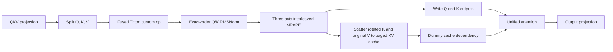

# Static-FP8 Q/K MRoPE and KV-cache fusion

## Overview

This optimization keeps the calibrated per-tensor static-FP8 linear path and
replaces the Qwen3-ASR attention preprocessing sequence with one specialized
Triton kernel. The kernel performs three operations together:

1. Q/K head-wise RMSNorm;
2. Qwen3-ASR three-axis interleaved MRoPE; and
3. the rotated-K and original-V scatter into vLLM's native BF16 paged KV
   cache.

The name `qk_prefill` is shorthand rather than a strict execution boundary.
The fused path runs during both decode and prefill. Only its launch
configuration is prefill-specific: inputs with at least 512 tokens use smaller
head groups and fewer warps to reduce per-program register pressure.

The implementation is out of tree. It does not change the installed PyTorch
2.11.0+cu128 or vLLM 0.24.0 packages.

## Why fuse this region?

For every decoder layer, the unmodified static-FP8 path separately computes
Q/K normalization and MRoPE, then launches vLLM's KV-cache scatter before
attention. Q and K are read and written between those stages, and the cache
update adds another launch per layer.

The optimized path keeps the normalized values in FP32 through rotation,
writes the final BF16 Q/K outputs, and writes rotated K plus the original V to
the paged cache from the same Triton program. This removes intermediate GPU
traffic and reduces the number of CUDA-graph nodes.



## Runtime integration

The dedicated entry point is
[`inference/run_vllm_fp8_static_qk_prefill.sh`](../inference/run_vllm_fp8_static_qk_prefill.sh).
It sets `ASR_QK_MROPE_FUSION=1`, resolves the locally cached Qwen3-ASR snapshot
when available, preserves the served model name `Qwen/Qwen3-ASR-1.7B`, and
then delegates to the standard static-FP8 launcher.

The standard launcher prepends `inference/vllm_static_fp8` to `PYTHONPATH` and
selects `--quantization fp8_static_json`. Python imports
[`sitecustomize.py`](../inference/vllm_static_fp8/sitecustomize.py) before vLLM
parses the quantization name. That imports
[`vllm_static_fp8_plugin.py`](../inference/vllm_static_fp8/vllm_static_fp8_plugin.py),
which installs the attention patch only when `ASR_QK_MROPE_FUSION=1`.

The resulting flow is:

```text
run_vllm_fp8_static_qk_prefill.sh
  -> ASR_QK_MROPE_FUSION=1
  -> run_vllm_fp8_static.sh
  -> sitecustomize.py
  -> vllm_static_fp8_plugin.py
  -> install_qk_mrope_fusion_patch()
  -> patched Qwen3Attention.forward()
  -> torch.ops.vllm.asr_qk_norm_mrope_kv_update
  -> unified_attention_with_output()
```

`install_qk_mrope_fusion_patch()` replaces `Qwen3Attention.forward` only once.
The patched forward retains the model's QKV and output projections but routes
Q, K, and V through the registered custom op before unified attention.

## Kernel specialization

The fast path deliberately targets the deployed Qwen3-ASR-1.7B layout:

| Property | Required value |
| --- | --- |
| Query heads | 16 |
| KV heads | 8 |
| Head dimension | 128 |
| Q/K/V dtype | BF16 |
| KV-cache dtype | BF16 |
| KV-cache tail layout | `[block_size, 8, 128]` |
| MRoPE axes | 3 |
| Interleaved MRoPE sections | `[24, 20, 20]` |

### Exact RMS reduction order

The first combined-kernel experiment reduced all 128 squared head values with
one `tl.sum`. That is mathematically equivalent to the compiled control, but
floating-point addition order changed enough BF16 values to increase
transcript drift.

The selected kernel matches the control graph's `R0_BLOCK=64` structure. It
first adds dimensions `d` and `d + 64`, producing 64 partial values, and then
reduces those 64 lanes:

```text
partial[d] = x[d] * x[d] + x[d + 64] * x[d + 64]
mean_square = sum(partial[0:64]) / 128
normalized = x * rsqrt(mean_square + epsilon) * rms_weight
```

The normalized values remain FP32 through MRoPE, matching the numerical
structure of the Inductor control. Isolated comparisons against the compiled
reference were bit-identical for all Q/K values at 1 and 16 tokens. At 128
tokens, only 2 of 262,144 Q values differed and all 131,072 K values were
identical.

### Three-axis MRoPE

Each rotary frequency selects temporal, height, or width position data from
the three-row `positions` tensor. The kernel loads the corresponding cosine
and sine values, normalizes the paired dimension, and applies the rotary
transform while values are still FP32. The final Q and K tensors are written
in their original BF16 layouts.

### Paged KV-cache write

For each token, the kernel reads vLLM's `slot_mapping`. A non-negative slot is
split into a cache block and an offset within that block. Only KV heads write
cache data:

- the rotated K value is stored in the key cache;
- the unmodified V projection value is stored in the value cache; and
- a `-1` slot is treated as padding and performs no cache write.

The custom op returns an empty tensor as a dependency token. It is passed as
`kv_cache_dummy_dep` to `unified_attention_with_output`, making the cache-write
ordering visible to vLLM's compiled graph even though attention does not use
the dummy tensor's contents.

### Decode and prefill dispatch

| Input tokens | Heads per program | Groups per token | Warps | Intended regime |
| ---: | ---: | ---: | ---: | --- |
| `< 512` | 16 | 2 | 4 | Decode and small batches |
| `>= 512` | 8 | 3 | 2 | Prefill |

The smaller prefill program gives up some launch amortization in exchange for
lower register pressure. Isolated H100 measurements improved the fused kernel
by about 9-12% for 660, 1,320, 1,980, and 4,096 tokens.

## Compatibility and fallbacks

The patched forward checks the MRoPE mode and section layout, Q/K head counts,
head dimension, and position rank. If the layer is not the expected
Qwen3-ASR-1.7B attention layout, it calls the original vLLM forward method.

The custom op separately validates the active KV cache. vLLM intentionally has
an empty or not-yet-final cache during parts of memory profiling and startup.
When the cache is unavailable or incompatible, the code still uses the fused
Q/K RMSNorm and MRoPE kernel but calls vLLM's native `do_kv_cache_update()` for
the cache scatter. This makes startup profiling correct without weakening the
runtime fast-path checks.

The patch relies on vLLM internal APIs, including forward context, encoded
layer names, custom-op registration, and `unified_attention_with_output`.
These are an explicit upgrade boundary: a vLLM update requires rechecking the
custom-op schema, attention signature, cache layout, and dependency argument.

## Correctness evidence

The combined cache path was compared with the earlier Q/K-only fusion followed
by vLLM's native cache update for:

- contiguous slots spanning a cache block; and
- shuffled slots spanning four blocks, including `-1` padding slots.

Both tests produced bit-identical Q, K, key-cache, and value-cache tensors.
The exact-order reduction check above was then used to select the current
arithmetic order. The detailed experiment trail remains in:

- [`ideas/qk_norm_mrope_triton_fusion.md`](../ideas/qk_norm_mrope_triton_fusion.md)
- [`ideas/qk_norm_mrope_kvcache_triton_fusion.md`](../ideas/qk_norm_mrope_kvcache_triton_fusion.md)
- [`ideas/qk_kvcache_exact_rms_reduction.md`](../ideas/qk_kvcache_exact_rms_reduction.md)
- [`ideas/qk_kvcache_prefill_head_grouping.md`](../ideas/qk_kvcache_prefill_head_grouping.md)

Those files are historical experiment logs. The benchmark tables below are
the current workspace snapshot and therefore supersede their older CSV-backed
end-to-end numbers.

## Nsight Systems evidence

The selected kernel and the original static-FP8 server were compared over the
same 20 dominant decode CUDA-graph replays from a hot-cache five-second
request:

| Metric per replay | Static FP8 | Fused path | Change |
| --- | ---: | ---: | ---: |
| Kernel launches | 366 | 309 | -15.6% |
| Summed GPU kernel time | 1.627 ms | 1.463 ms | -10.1% |
| First-to-last replay envelope | 1.649 ms | 1.475 ms | -10.6% |

The fused node executes once in each of 28 decoder layers. Across the full
captured request, launches fell from 8,087 to 6,890 and summed GPU time fell
from 39.907 ms to 36.452 ms.

This profile establishes that the kernel removes GPU work and launches. It is
not an end-to-end ASR profile: the warmup and measured request use the same
audio, so the multimodal processor and encoder are hot-cached. End-to-end
latency, TTFT, throughput, CER, and WER decisions must come from
`run_benchmark.py`.

## Current benchmark results

The following tables come from:

```bash
uv run inference/analyse_results.py --mode batched
uv run inference/analyse_results.py --mode sequential
```

They compare the newest qualifying rows in the current CSV files. The static
control rows were collected on July 19, 2026 UTC and the fused rows on July
20, 2026 UTC. They are single workspace snapshots, not interleaved repetitions
or confidence intervals.

### Full batched benchmark: 550 files, 16 workers

| Variant | Lat p50 | Lat p95 | Lat p99 | TTFT p50 | TTFT p95 | TTFT p99 | Files/s | CER | WER |
| --- | ---: | ---: | ---: | ---: | ---: | ---: | ---: | ---: | ---: |
| Static FP8 | 3.346 | 6.675 | 9.124 | 0.426 | 1.177 | 1.984 | 4.352 | 0.161949 | 0.384468 |
| Fused Q/K path | 3.137 | 6.276 | 8.382 | 0.385 | 1.069 | 1.761 | 4.604 | 0.166400 | 0.386682 |

The fused run improves throughput by 5.8%, p50/p95/p99 latency by
6.2%/6.0%/8.1%, and p50/p95/p99 TTFT by 9.6%/9.2%/11.2%. CER increases by
`0.004451` and WER by `0.002214`. That quality movement is larger than the
earlier controlled experiment and needs a paired rerun before it is treated as
deterministic kernel drift or ordinary run-to-run variation.

### Full sequential benchmark: 550 files

| Variant | Lat p50 | Lat p95 | Lat p99 | TTFT p50 | TTFT p95 | TTFT p99 | Files/s | CER | WER |
| --- | ---: | ---: | ---: | ---: | ---: | ---: | ---: | ---: | ---: |
| Static FP8 | 1.381 | 2.745 | 3.439 | 0.207 | 0.339 | 0.372 | 0.682 | 0.162277 | 0.384183 |
| Fused Q/K path | 1.315 | 2.599 | 3.275 | 0.220 | 0.341 | 0.373 | 0.716 | 0.162677 | 0.384538 |

The fused run improves throughput by 5.0% and latency percentiles by about
4.8-5.3%. TTFT p50 is 6.3% worse, while p95 and p99 are approximately flat.
The absolute quality changes are `+0.000400` CER and `+0.000355` WER.

### One-hundred-file, 50-second clipped benchmark

| Mode | Variant | Lat p50 | Lat p95 | Lat p99 | TTFT p50 | TTFT p95 | TTFT p99 | Files/s |
| --- | --- | ---: | ---: | ---: | ---: | ---: | ---: | ---: |
| Batched, 16 workers | Static FP8 | 0.652 | 1.098 | 1.212 | 0.119 | 0.306 | 0.332 | 22.171 |
| Batched, 16 workers | Fused Q/K path | 0.636 | 1.226 | 1.424 | 0.122 | 0.499 | 0.614 | 22.635 |
| Sequential | Static FP8 | 0.273 | 0.468 | 0.489 | 0.059 | 0.075 | 0.090 | 3.538 |
| Sequential | Fused Q/K path | 0.262 | 0.451 | 0.473 | 0.063 | 0.087 | 0.091 | 3.731 |

The clipped batched snapshot improves throughput by 2.1% and p50 latency by
2.5%, but p95/p99 latency and all TTFT percentiles regress. The clipped
sequential snapshot improves throughput by 5.5% and latency by roughly 3-4%,
with mixed or worse TTFT. These clipped runs are intentionally not scored for
CER/WER.

## Running the optimized server

Choose a free GPU and start the dedicated launcher:

```bash
export CUDA_VISIBLE_DEVICES=4
PORT=8090 bash inference/run_vllm_fp8_static_qk_prefill.sh
```

The wrapper forwards additional vLLM arguments. For example:

```bash
PORT=8090 bash inference/run_vllm_fp8_static_qk_prefill.sh \
  --gpu-memory-utilization 0.5
```

Use `bash inference/run_vllm_fp8_static.sh` for the unfused static-FP8 control.

## Reproducing the benchmark rows

Run the server and candidate benchmarks on the same free GPU, using a distinct
output root containing `fp8_static_qk_prefill` so `analyse_results.py` assigns
the correct label:

```bash
uv run inference/run_benchmark.py \
  --mode batched \
  --workers 16 \
  --overwrite \
  --output-root predictions/results_fp8_static_qk_prefill/batched_predicted

uv run inference/run_benchmark.py \
  --mode batched \
  --workers 16 \
  --uniform-audio-length 50 \
  --num-files 100 \
  --overwrite \
  --output-root \
    predictions/results_fp8_static_qk_prefill/batched_predicted_uniform_audio_length_50s

uv run inference/run_benchmark.py \
  --mode sequential \
  --overwrite \
  --output-root predictions/results_fp8_static_qk_prefill/sequential_predicted

uv run inference/run_benchmark.py \
  --mode sequential \
  --uniform-audio-length 50 \
  --num-files 100 \
  --overwrite \
  --output-root \
    predictions/results_fp8_static_qk_prefill/sequential_predicted_uniform_audio_length_50s
```

For a stronger comparison, alternate fresh static-control and fused servers
and collect at least three repetitions per workload. Use identical overwrite,
warmup, input ordering, worker count, GPU, and vLLM arguments. The latest full
batched quality change and the clipped batched tail regression are the two
highest-priority items to confirm.

## Where things live

| Path | Role |
| --- | --- |
| `inference/run_vllm_fp8_static_qk_prefill.sh` | Optimized server entry point and cached-model resolution |
| `inference/run_vllm_fp8_static.sh` | Static-FP8 base launcher and control entry point |
| `inference/vllm_static_fp8/sitecustomize.py` | Early plugin import hook |
| `inference/vllm_static_fp8/vllm_static_fp8_plugin.py` | Static-FP8 registration and conditional patch install |
| `inference/vllm_static_fp8/qk_mrope_fusion_patch.py` | Triton kernel, custom op, fallbacks, and attention patch |
| `inference/run_benchmark.py` | End-to-end benchmark and quality wrapper |
| `inference/analyse_results.py` | Current CSV comparison tables |
| `ideas/qk_*.md` | Historical candidate experiments and selection evidence |

## Known limitations

- The kernel is not a general Qwen or generic attention fusion. Its fast path
  is specialized to Qwen3-ASR-1.7B's current layout.
- The patch depends on vLLM private/internal interfaces and must be revalidated
  when vLLM changes.
- The first unseen Triton shape can JIT-compile during inference. Warmups must
  cover representative decode and prefill shapes before measuring latency.
- The current `analyse_results.py` rounds displayed values to three decimals;
  use the CSV rows for small CER/WER comparisons.
- Sequential analysis selects the newest qualifying row per label, while
  batched analysis prints all qualifying rows. Multiple matching batched rows
  require manual pairing.
- The current full candidate and control results were not interleaved. They
  demonstrate a promising performance shift, not statistical significance.
- Same-GPU MPS or multiple replicas are a separate service-level experiment
  and must not be attributed to this single-replica kernel optimization.
