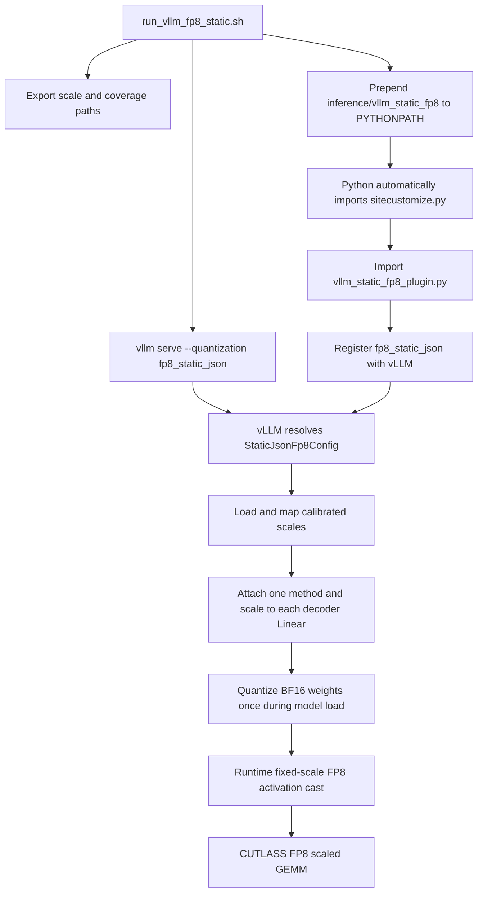

# Out-of-tree vLLM static-FP8 extension

This document has two goals:

1. Explain how this repository adds a quantization method to vLLM without
   modifying or installing files into vLLM.
2. Explain how calibrated per-tensor activation scales are injected into
   vLLM's FP8 linear path.

The extension consumes a scale artifact produced by
[Static FP8 activation calibration](fp8-calibration.md).

## Quick start

Generate or select a calibration artifact, then launch vLLM:

```bash
SCALES_JSON=inference/results/fp8_static_scales_128x50.json \
  bash inference/run_vllm_fp8_static.sh
```

The current launcher defaults to that artifact, so this is equivalent when the
file exists:

```bash
bash inference/run_vllm_fp8_static.sh
```

Optional server settings are environment variables, while additional vLLM
arguments can be appended:

```bash
MODEL=Qwen/Qwen3-ASR-1.7B \
HOST=0.0.0.0 \
PORT=8090 \
SCALES_JSON=inference/results/fp8_static_scales_128x50.json \
  bash inference/run_vllm_fp8_static.sh --gpu-memory-utilization 0.9
```

## Architecture



The key idea is that normal Python startup performs the registration before
vLLM parses and resolves the `--quantization` value.

## Final composed Qwen3-ASR launcher

The static-FP8 extension is the base of the current optimized server:

```bash
PORT=8091 \
  bash inference/run_vllm_fp8_static_qk_prefill_audio_prefix_suffix_cudagraph.sh
```

The launcher chain enables the fused Q/K RMSNorm + MRoPE + KV-cache patch,
CPU audio max-seqlen, CPU metadata/Triton row packing, and the natural-only
audio prefix/suffix CUDA graph caches before delegating to this document's
`fp8_static_json` launcher. The graph runners are installed together through
one metadata-aware audio forward; a graph miss executes that optimized eager
path, while an unsupported metadata/runtime contract returns to the original
vLLM forward.

The audio metadata patch is additionally pinned to vLLM `0.24.0+cu129` and the
expected wheel URL/hash in `uv.lock`. See
[Qwen3-ASR audio lengths and CUDA-graph fast-path coverage](qwen3-asr-audio-length-and-graph-fast-path.md)
for the composed runtime flow and
[the final benchmark report](audio-natural-only-cudagraph-benchmark.md) for
current results.

## How the out-of-tree hook works

### 1. The launcher exports the inputs

`inference/run_vllm_fp8_static.sh` validates `SCALES_JSON` and exports its
absolute path as:

```text
ASR_FP8_STATIC_SCALES_JSON
```

It also exports a diagnostic coverage path and prepends the extension directory
to `PYTHONPATH`:

```bash
export PYTHONPATH="$SCRIPT_DIR/vllm_static_fp8${PYTHONPATH:+:$PYTHONPATH}"
```

`uv run` starts vLLM in the project environment, but it does not install this
extension. The environment and `PYTHONPATH` are the connection.

### 2. Python imports `sitecustomize.py`

`sitecustomize` is a special Python module name. During a normal startup,
Python's `site` initialization attempts to import it from the active import
path. Because the launcher added `inference/vllm_static_fp8`, Python finds:

```text
inference/vllm_static_fp8/sitecustomize.py
```

That file imports `vllm_static_fp8_plugin` only when
`ASR_FP8_STATIC_SCALES_JSON` is set. This keeps the hook inert for unrelated
Python commands that happen to use the same import path.

### 3. Importing the plugin registers a quantization name

The plugin declares:

```python
@register_quantization_config("fp8_static_json")
class StaticJsonFp8Config(Fp8Config):
    ...
```

The decorator runs when the module is imported. It adds
`fp8_static_json` to vLLM's quantization-config registry before the CLI resolves:

```bash
--quantization fp8_static_json
```

This is an out-of-tree extension because the repository supplies a class that
implements vLLM's expected interface while leaving the vLLM wheel untouched.

### The reusable extension pattern

The repository-specific details are FP8 scales and Qwen3-ASR names, but the
out-of-tree pattern is general:

1. Put extension code somewhere Python can import without patching the
   dependency.
2. Arrange for that code to be imported before the host application resolves
   its configuration. This repository uses `sitecustomize`.
3. Register a new name through the host application's registry.
4. Implement the interface the host expects for that registered component.
5. Select the registered name through the host application's normal CLI or
   configuration.

This pattern keeps experimentation local and reversible. It does not make the
interface stable: because this plugin subclasses and imports internal vLLM
objects, vLLM upgrades still require compatibility testing.

## Loading and matching scales

`StaticJsonFp8Config` inherits vLLM's `Fp8Config`, declares that the checkpoint
is not already FP8-serialized, and selects a static activation scheme. It then
loads the calibration JSON and validates:

- format `qwen3_asr_fp8_static_activation_scales`;
- artifact version `1`;
- a non-empty `vllm_fused_modules` mapping;
- finite, positive scale values;
- unique module names after mapping.

The calibration recorder observes Transformers module names, while vLLM builds
different prefixes. The plugin translates, for example:

```text
thinker.model.layers.0...
    -> language_model.model.layers.0...

thinker.audio_tower....self_attn.qkv_proj
    -> audio_tower....self_attn.qkv
```

The current artifact contains 211 fused entries. The plugin retains the 112
`language_model.model.*` decoder entries and ignores 99 audio-tower entries.
vLLM's Qwen3-ASR audio tower does not construct its linears with this quantization
configuration, so it remains BF16 in both the dynamic and static FP8 runs.

## How scales reach vLLM linear layers

During model construction, vLLM asks the quantization config for a method for
each layer and its prefix. `StaticJsonFp8Config.get_quant_method()`:

1. Delegates non-linear layers to the normal `Fp8Config` behavior.
2. Honors vLLM's ignored-layer logic.
3. Looks up the exact decoder prefix in the calibrated scale table.
4. Returns `StaticPerTensorOnlineLinearMethod` with that scale.

Missing scales are fatal. The plugin raises a `KeyError` with nearby calibrated
names instead of silently falling back to dynamic quantization. This catches a
changed checkpoint layout or an incompatible vLLM model implementation during
startup.

`StaticPerTensorOnlineLinearMethod` subclasses vLLM's built-in
`Fp8PerTensorOnlineLinearMethod`. Its essential change is:

```python
self.activation_quant_key = kFp8StaticTensorSym
```

That tells vLLM's FP8 kernel setup to expect a supplied, static per-tensor
activation scale instead of calculating a dynamic token scale.

## Model load versus request time

The word “static” applies to activations in this implementation. The source
checkpoint remains BF16.

| Quantity | Source | When determined |
| --- | --- | --- |
| FP8 weight and weight scale | vLLM quantizes the BF16 weight | Once during model loading |
| Activation scale | Calibration JSON | Before serving, then attached during model loading |
| Activation FP8 values | Current layer input | Every request |

After vLLM processes a layer's weights, the custom method installs the
calibrated scalar on the same device:

```python
layer.input_scale = torch.tensor(
    static_input_scale,
    dtype=torch.float32,
    device=layer.weight.device,
)
```

One scalar is attached to each fused decoder linear. The scalar is shared by
all batches, rows, and tokens that pass through that layer; it is not one global
scale for the whole model.

At request time, the operation is approximately:

```text
x_fp8 = cast_fp8(x / input_scale)
output = scaled_fp8_gemm(x_fp8, weight_fp8, input_scale, weight_scale)
```

The actual FP8 cast performs representable-value rounding and saturation.

Dynamic FP8 must first derive a scale from the current activation, conceptually:

```text
runtime_absmax = max(abs(x), over the dynamic scaling group)
input_scale = runtime_absmax / 448
```

Supplying a calibrated scale removes that runtime absmax/reduction path. The
CUTLASS FP8 matrix multiplication still runs; only the way the activation scale
is obtained changes.

## Coverage diagnostics

The launcher defaults to:

```text
/tmp/asr_fp8_static_coverage_<port>_<pid>.json
```

The literal `{pid}` in the shell template is replaced by the engine process ID
inside the plugin. Separate engine processes therefore do not overwrite one
another's report.

The report contains:

- `scale_count`;
- `matched_count` and `matched_prefixes`;
- `materialized_count` and `materialized_prefixes`;
- `unused_prefixes`;
- engine PID.

For a successful load of the current decoder table, expect:

```text
scale_count        = 112
matched_count      = 112
materialized_count = 112
unused_prefixes    = []
```

Find and inspect the report for the port and PID printed by the launch you are
checking:

```bash
ls -lt /tmp/asr_fp8_static_coverage_8090_*.json
jq . /tmp/asr_fp8_static_coverage_8090_<pid>.json
```

Coverage is diagnostic only. vLLM never reads this file for inference, and it
does not need to be copied to a new machine. The calibration scale JSON is the
portable input that must be copied or regenerated.

To place coverage somewhere persistent:

```bash
ASR_FP8_STATIC_COVERAGE_JSON='inference/results/static_fp8_coverage_{pid}.json' \
  bash inference/run_vllm_fp8_static.sh
```

## Portability and upgrade boundaries

Copy these items to a new machine:

- the repository code, including `inference/vllm_static_fp8`;
- the calibrated scale JSON;
- the matching model/checkpoint or model identifier;
- the pinned project environment.

Do not copy `/tmp/asr_fp8_static_coverage_*.json`; it will be regenerated.

This extension uses internal vLLM classes and constants rather than a stable
external plugin ABI. It is currently coupled to the repository's vLLM `0.24.0`
environment. After upgrading vLLM, revalidate:

- quantization registration and config construction;
- `Fp8PerTensorOnlineLinearMethod` behavior;
- static quantization-key names;
- `process_weights_after_loading`;
- Qwen3-ASR layer prefixes;
- full matched/materialized coverage;
- CER/WER and performance.

## Troubleshooting

### `Unknown quantization method: fp8_static_json`

The plugin was not imported before vLLM parsed its CLI. Check that the launcher
prepended `inference/vllm_static_fp8` to `PYTHONPATH` and that
`ASR_FP8_STATIC_SCALES_JSON` is set.

### `No calibrated static FP8 activation scale for vLLM layer ...`

The JSON and vLLM module layout do not match. Confirm the model and revision,
then recalibrate or update the explicit name mapping. Do not add a silent
dynamic fallback; it would invalidate a static-versus-dynamic comparison.

### Partial coverage file

A failed or interrupted startup can leave a report with partial counts. Inspect
the file for the PID of the server that actually reached readiness, not simply
the newest file from a different port or failed launch.

### Accuracy regression

Coverage checks name matching, not calibration quality. Inspect the scale
artifact's input set and margin, recalibrate on representative data, and rerun
the full CER/WER evaluation.

## Files involved

- `inference/run_vllm_fp8_static.sh`: validates inputs, configures the import
  hook, and selects `fp8_static_json`.
- `inference/vllm_static_fp8/sitecustomize.py`: automatic Python startup hook.
- `inference/vllm_static_fp8/vllm_static_fp8_plugin.py`: registration, JSON
  validation, name mapping, layer-method selection, scale injection, and
  coverage reporting.
- `inference/results/fp8_static_scales_128x50.json`: current calibration input.
